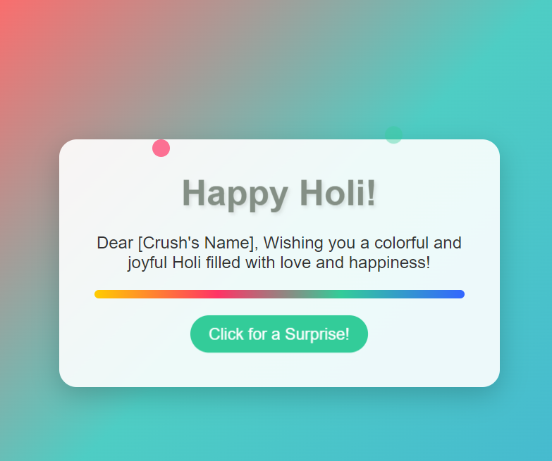

# Happy Holi Greeting

A colorful, animated web greeting to wish your crush a "Happy Holi" with fireworks, confetti, and synchronized sound effects. Built with HTML, CSS, and JavaScript, this project features a vibrant design inspired by the Holi festival.

## Features

- **Animations:** Bouncing title, sliding message, rotating color splash, pulsing button, floating particles, confetti bursts, and enhanced firework effects.
- **Sound Effects:** Synchronized audio for fireworks, confetti pops, a surprise message ding, and looping background music.
- **Interactivity:** Click the "Surprise" button to reveal a heartfelt message with dazzling effects.
- **Responsive Design:** Works on desktop and mobile devices.

## Demo Image

---

## Demo

Open `index.html` in a browser to see the greeting in action. Click the button to trigger the surprise!

## Setup Instructions

### Prerequisites

- A modern web browser (Chrome, Firefox, Edge, etc.).
- Audio files (see below).

### Files

- `index.html`: Main structure of the greeting.
- `styles.css`: Styling and animations.
- `script.js`: Logic for interactivity and sound synchronization.

#### Audio files:

- `firework.mp3`: Firework explosion sound (~1-2 seconds).
- `holi-bg.mp3`: Festive Holi background music (loopable).
- `pop.mp3`: Confetti pop sound (~0.5 seconds).
- `ding.mp3`: Cheerful ding for the surprise message (~0.5-1 second).

### Steps

1. **Clone or Download:**
   - Download all files into a single folder.

2. **Add Audio Files:**
   - Place `firework.mp3`, `holi-bg.mp3`, `pop.mp3`, and `ding.mp3` in the same folder as `index.html`.
   - Alternatively, update the `src` attributes in `index.html` if using a subfolder (e.g., `src="sounds/firework.mp3"`).

3. **Open in Browser:**
   - Double-click `index.html` or open it via a local server (e.g., live-server in VS Code).

4. **Interact:**
   - Click the "Click for a Surprise!" button to trigger animations and sounds.
   - Background music may require an initial click due to browser autoplay restrictions.

## Dependencies

- **Confetti Library:** Included via CDN (`canvas-confetti@1.5.1`). No local installation needed.

## Customization

- **Personalize:** Replace `[Crush's Name]` in `index.html` with your crush’s name.
- **Volume:** Adjust sound levels in `script.js` (e.g., `bgMusic.volume = 0.3`).
- **Animations:** Tweak timings or styles in `styles.css` (e.g., firework burst duration).
- **Audio:** Swap audio files for different effects (ensure short durations for synchronization).

## Troubleshooting

### Sounds Not Playing:

- **Check Paths:** Ensure audio files are in the correct folder and match `src` attributes.
- **Browser Console:** Open DevTools (`F12`) > Console to see errors (e.g., "NotAllowedError" or "Failed to load resource").
- **Autoplay:** Click the page first to unlock audio, then try the button.
- **Test Files:** Verify each `.mp3` plays in a media player.

### Animations Not Showing:

- Ensure `styles.css` and `script.js` are linked correctly.

### Confetti Missing:

- Confirm the CDN link in `index.html` is accessible.

## Finding Audio Files

Use royalty-free sources like:

- [Freesound.org](https://freesound.org) (e.g., search "firework explosion," "party popper," "bell ding").
- [Pixabay](https://pixabay.com/music) (e.g., Indian background music).
- Convert to MP3 if needed using [Online Converter](https://online-audio-converter.com/).

## Credits

- **Developed by:** [Your Name] with assistance from Grok 3 (xAI).
- **Confetti:** `canvas-confetti` by CatDad.
- **Inspiration:** Holi festival’s vibrant colors and joy.

## License

For personal use only. Audio files should be royalty-free or licensed appropriately if shared publicly.

---

### How to Use

1. Copy the text above into a file named `README.md`.
2. Replace `[Your Name]` with your name if desired.
3. Save it in your project folder alongside `index.html`, `styles.css`, `script.js`, and the audio files.
4. Open it in a Markdown viewer (e.g., GitHub, VS Code) to see it formatted.

---

Enjoy spreading Holi cheer with your personalized, interactive greeting! 🎉✨